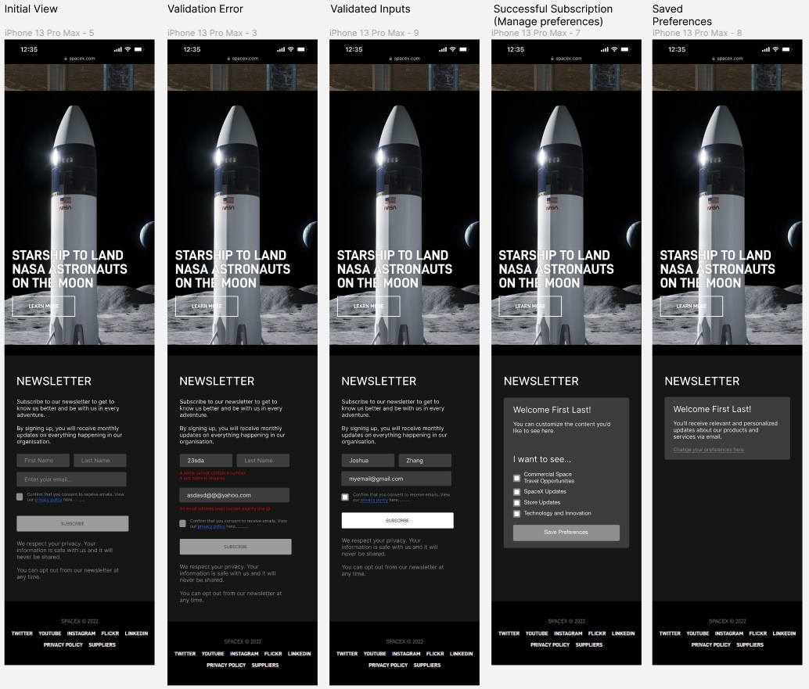

## Accessing the site
Access the app here: https://ux-colab.web.app/

Both responsive on desktop and mobile.

## Features

Space Origin is a full stack application that allows users to subscribe to newsletters and edit their preferences.

The features include:

Subscription to Newsletter Functionality
Edit Subscription Functionality
A database is used to store user information and subscription preferences.

Users have the ability to do the following:
Sign Up to the newsletter
Select and edit their newsletter preferences
View a dashboard with user sign up statistics.

## Technologies used

Front end
Reactjs
Axios

Back end
Firebase

## Approach taken

Planning
Given the short timeframe for the project sprint (2 days) we wanted to maximise functionality whilst minimise work with the backend. Firebase seemed like an appropriate choice given its easy use and setup.

The designs were created by the UX team using figma (designs below) with mobile and desktop view in mind.

Given the short timeframe we did not feel it was necessary to implement a full User Authetication login system with firebase so we opted to save user login data in local storage to allow them to edit their preferences.

## Lessons learnt

To communicate effectively with the UX team and share ideas and determine the scope of the project. It was important to let the designers know what features were difficult to implement in the given timeframe and what features were not.

Pair programming was also very effective, especially using liveshare on VS code to simultaneously work on the project without stepping on each others toes.

## Future improvements

We could not fully implement the dashboard feature due to running out of time, this would need to be improved in the future.

In the future, I would like to add/improve the following:

The dashboard tables are not mobile responsive and no other analytical data is displayed besides just the user information and preferences.

